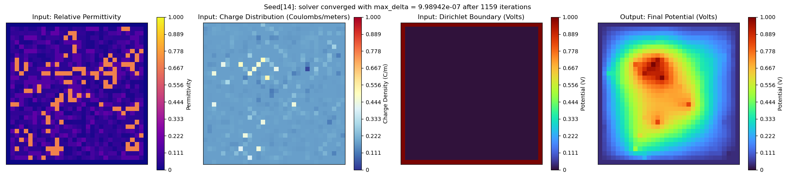
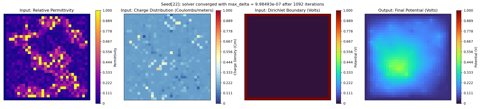
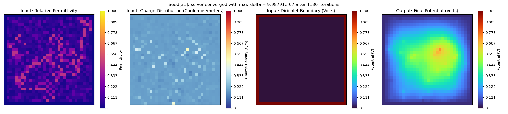
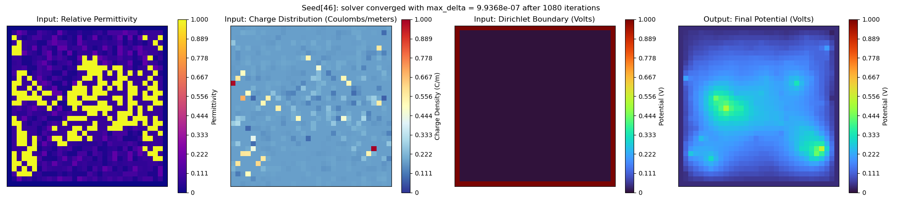
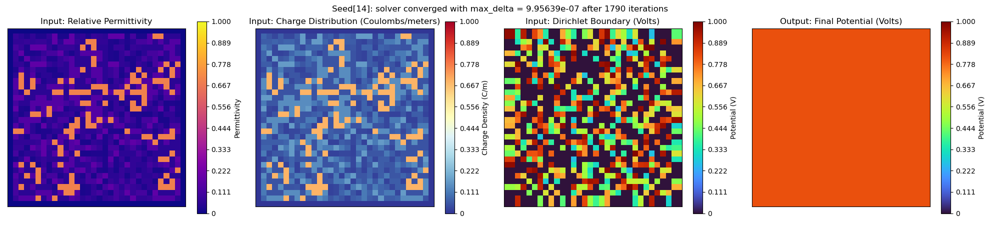
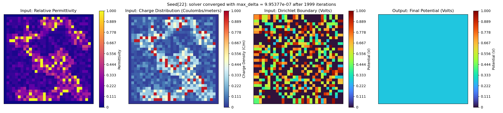
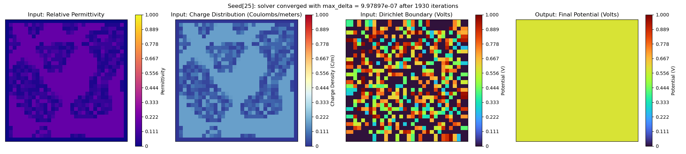
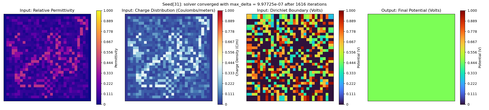
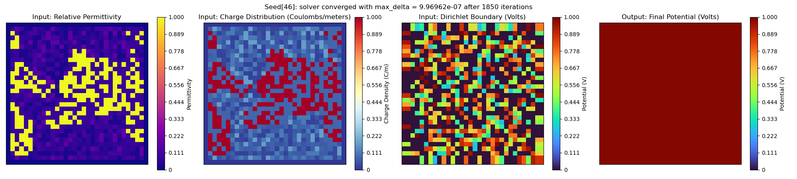

# Electrostatic Potential (ESP) Simulation

## Create and activate Conda environment

```bash
cd esp_simulation
conda env create -f environment.yaml
conda activate esp_env
```

### Notes
- Most of the packages are common, so you may already have these installed

## Generate and save datasets

### File: `create_dataset.py`

```bash
usage: create_dataset.py [-h] [-d] [--ntasks NUM_TASKS] [--seed-step SEED_STEP]
     [--image-size IMAGE_SIZE] [--min-seed MIN_SEED]
     [--max-seed MAX_SEED]
     (--conductive-cell-ratio CONDUCTIVE_CELL_RATIO | --conductive-cell-prob CONDUCTIVE_CELL_RATIO)
     (--conductive-material-range CONDUCTIVE_MATERIAL_RANGE | --conductive-material-count CONDUCTIVE_MATERIAL_COUNT)
     [--enable-absolute-permittivity] [--enable-fixed-charges]
     [--max-iterations MAX_ITERATIONS]
     [--convergence-tolerance CONVERGENCE_TOLERANCE] [--save-states]
     [--output-path OUTPUT_PATH] [--output-folder OUTPUT_FOLDER]

Electro Static Potential Simulation

options:
  -h, --help            
    show this help message and exit
  -d, --debug           
    Enables logging with debug level verbosity | default: false

multi-process options:
  --ntasks NUM_TASKS    
    Number of parallel tasks (CPU cores). Max threads = 2 x NUM_TASKS if multithreading is on (default: 1)
  --seed-step SEED_STEP
    Number of seeds to be processed and written at a time | default: 100

image generation options:
  --image-size IMAGE_SIZE
    Length for one side of 2D image | default: 32
  --min-seed MIN_SEED   
    Start seed for generating images from MIN_SEED to MAX_SEED | default: 1
  --max-seed MAX_SEED   
    Ending seed for generating images from MIN_SEED to MAX_SEED | default: 100
  --conductive-cell-ratio CONDUCTIVE_CELL_RATIO
    Proportion of cells that should be conductive (Before cellular automata) | required
  --conductive-cell-prob CONDUCTIVE_CELL_RATIO
    Probability a cells will be conductive or not (Before cellular automata) | required
  --conductive-material-range CONDUCTIVE_MATERIAL_RANGE
    Range to randomly pick a number of conductive materials; max range = 12 | required
  --conductive-material-count CONDUCTIVE_MATERIAL_COUNT
    Static count of total conductive materials; max count = 12 | required
  --enable-absolute-permittivity
    Enables converting material permittivity from relative to absolute | default: false
  --enable-fixed-charges
    Enables solving for fixed charges, charges are free by default | default: false
  --max-iterations MAX_ITERATIONS
    Maximum allowed iterations to run electrostatic potential solvers | default: 3000
  --convergence-tolerance CONVERGENCE_TOLERANCE
    Convergence threshold, simulation stops when the max delta between states falls below this value (default: 1e-6)
  --save-states         
    Enables saving states, where iteration is a power of two | default:false

output path options:
  --output-path OUTPUT_PATH
    Path the the directory to create [--output-folder] and save to | default: current directory
  --output-folder OUTPUT_FOLDER
    Output folder name to create and save simulation data to | default: esp_dataset
```

### Example 1: Create a dataset with Poisson's Solver (free charges)

```bash
python create_dataset.py \
  --output-folder=hdf5_dataset_example \
  --ntasks=1 \
  --min-seed=1 \                 
  --max-seed=1000 \ 
  --seed-step=100 \ 
  --image-size=32 \ 
  --max-iterations=2000 \
  --conductive-cell-prob=0.7 \ 
  --conductive-material-range=1,10 
```
> Outputs: ./hdf5_dataset_example_1/electrostatic_poisson_32x32_1-1000.hdf5

### Example 2: Create a dataset with Laplace's solver (fixed charges)

```bash
python create_dataset.py \
  --output-folder=hdf5_dataset_example \
  --ntasks=2 \
  --min-seed=1 \                 
  --max-seed=1000 \ 
  --seed-step=100 \ 
  --image-size=32 \ 
  --max-iterations=3000 \
  --conductive-cell-ratio=0.5 \ 
  --conductive-material-count=5 \
  --enable-fixed-charges
```
> Outputs: ./hdf5_dataset_example_2/electrostatic_laplace_32x32_1-1000.hdf5

## Normalize dataset, plot samples, or reformat for SimVP

### File: `process_dataset.py`

```bash
usage: process_dataset.py [-h] [-d] [--dataset-path DATASET_PATH] [--normalize] [--simvp-format] [--sample-plots SAMPLE_PLOTS] [--plot-states] [--output-path OUTPUT_PATH] [--output-folder OUTPUT_FOLDER]

Electro Static Potential Simulation

options:
  -h, --help            
    show this help message and exit
  -d, --debug           
    Enables logging with debug level verbosity | default: false

dataset options:
  --dataset-path DATASET_PATH
    Path the the input dataset to read and process | default: current directory
  --normalize
    Option to normalize simulation inputs and outputs to [0, 1] using min-max scaling | default: false
  --simvp-format
    Option to save dataset formatted for SimVP | default: false
  --sample-plots SAMPLE_PLOTS
    Optional number of samples to plot; No samples are plotted if set to 0 | default: 0
  --plot-states
    Option to plot intermediate simulation states; Requires passing [--save-states] to create_dataset.py | default: false

output path options:
  --output-path OUTPUT_PATH
    Path the the directory to create [--output-folder] and save to | default: current directory
  --output-folder OUTPUT_FOLDER
    Output folder name to create and save simulation data to | default: esp_dataset
```

### Example 1: Normalize and convert HDF5 samples into SimVP format

```bash
python process_dataset.py \
    --dataset-path="esp_dataset_example/electrostatic_poisson_32x32_1-1000.hdf5" \
    --output-folder=simvp_format_example \
    --normalize \
    --simvp-format
```
> Outputs: ./simvp_dataset_1/[simvp formatted structures ...]

### Example 2: Saved a normalized version of an existing HDF5 dataset

```bash
python process_dataset.py \
    --dataset-path="esp_dataset_example/electrostatic_poisson_32x32_1-1000.hdf5" \
    --normalize
```
> Outputs: ./esp_dataset_example/normalized_electrostatic_poisson_32x32_1-1000.hdf5

### Example 3: Plot 25 samples from existing HDF5 datasets

```bash
python process_dataset.py \
    --dataset-path="esp_dataset_example/electrostatic_poisson_32x32_1-1000.hdf5" \
    --sample-plots=25 
```
> Outputs: ./esp_dataset_example/plots/[sample plot files ...]
> Plot files are saved as: `electrostatic_poisson_32x32_<seed>.png` 

```bash
python process_dataset.py \
    --dataset-path="esp_dataset_example/normalized_electrostatic_poisson_32x32_1-1000.hdf5" \
    --sample-plots=25 
```
> Outputs: ./esp_dataset_example/plots/[normalized sample plot files ...]
> Plot files are saved as: `normalized_electrostatic_poisson_32x32_<seed>.png` 


## Sample Images

### Poisson's Solver (free charges)






---

### Laplace's solver (fixed charges)





*Note: Images with small variations may appear uniform due to normalization across a global color map range.*


## Dataset Notes

### HDF5 Format
- Each simulation is saved to a HDF5 group named `record_<id>`
- Each saved record contains 4 subgroups:
  - **Array groups** (`mask`, `image`): stored as HDF5 datasets
  - **Scalar groups** (`meta`, `metric`): stored as HDF5 attributes
- Below is the data structure of each simulation record
  
  <details>
  <summary> SHOW RECORD DATA STRUCTURE </summary> 

  ```plaintext
  GROUP "record_<#>" {
      GROUP "image" {
          DATASET "charge_distribution" {
            DATATYPE  H5T_IEEE_F64LE
            DATASPACE  SIMPLE { ( 32, 32 ) / ( 32, 32 ) }
          }
          DATASET "final_potential_map" {
            DATATYPE  H5T_IEEE_F64LE
            DATASPACE  SIMPLE { ( 32, 32 ) / ( 32, 32 ) }
          }
          DATASET "initial_potential_map" {
            DATATYPE  H5T_IEEE_F64LE
            DATASPACE  SIMPLE { ( 32, 32 ) / ( 32, 32 ) }
          }
          DATASET "permittivity_map" {
            DATATYPE  H5T_IEEE_F64LE
            DATASPACE  SIMPLE { ( 32, 32 ) / ( 32, 32 ) }
          }
      }
      GROUP "mask" {
          DATASET "conductive_material_map" {
            DATATYPE  H5T_STD_I64LE
            DATASPACE  SIMPLE { ( 32, 32 ) / ( 32, 32 ) }
          }
          DATASET "material_category_map" {
            DATATYPE  H5T_STD_I64LE
            DATASPACE  SIMPLE { ( 32, 32 ) / ( 32, 32 ) }
          }
          DATASET "material_id_map" {
            DATATYPE  H5T_STD_I64LE
            DATASPACE  SIMPLE { ( 32, 32 ) / ( 32, 32 ) }
          }
      }
      GROUP "meta" {
          ATTRIBUTE "converged" {
            DATATYPE  H5T_STD_I64LE
            DATASPACE  SCALAR
          }
          ATTRIBUTE "image_size" {
            DATATYPE  H5T_STD_I64LE
            DATASPACE  SCALAR
          }
          ATTRIBUTE "max_delta" {
            DATATYPE  H5T_IEEE_F64LE
            DATASPACE  SCALAR
          }
          ATTRIBUTE "random_seed" {
            DATATYPE  H5T_STD_I64LE
            DATASPACE  SCALAR
          }
          ATTRIBUTE "total_iterations" {
            DATATYPE  H5T_STD_I64LE
            DATASPACE  SCALAR
          }
      }
      GROUP "metric" {
          ATTRIBUTE "electric_flux" {
            DATATYPE  H5T_IEEE_F64LE
            DATASPACE  SCALAR
          }
          ATTRIBUTE "total_charge" {
            DATATYPE  H5T_IEEE_F64LE
            DATASPACE  SCALAR
          }
          ATTRIBUTE "total_energy" {
            DATATYPE  H5T_IEEE_F64LE
            DATASPACE  SCALAR
          }
      }
  }
  ```
  </details>

---

### SimVP Format
- Target format for: https://github.com/drewg02/OpenSTL.git
- Each frame → folder: `<hash>_<datatype>_<id>`
  - Files:
    - `0.npy`: Input (3-channel): `initial_potential_map`, `permittivity_map`, `charge_distribution`
    - `1.npy`: Output (1-channel): `final_potential_map`
- Global extrema saved to: `global_extrema_npy_<original_datafile>.json`

---

### Reproducibility
- Samples are generated via `[--min-seed]` to `[--max-seed]`
- Simulations reproducible with same *seed* and *input arguments*
  - Arguments are saved to: `arguments_<original_datafile>.json`

---

### Normalization
- Only `image` arrays and `metric` scaler are normalized
  - `mask` arrays are considered categorical
- Global extrema is saved to: `global_extrema_hdf5_<original_datafile>.json`
  - This can be used for min-max scaling in another program

---

### Example Scripts
- Example Scripts in `example_scripts/`:
  - `create_hdf5_dataset.sh` → `create_dataset.py`: Generates HDF5 dataset from simulation runs
  - `normalize_hdf5_dataset.sh` → `process_dataset.py`: Normalizes HDF5 dataset
  - `plot_dataset_samples.sh` → `process_dataset.py`: Plots samples from original and normalized HDF5 dataset
  - `reformat_for_simvp.sh` → `process_dataset.py`: Converts HDF5 to SimVP format


## Material Notes

### Material Mask Generation

1. **Initial conductive mask**  
   - `--conductive-cell-ratio`: sets a fixed percentage of conductive cells  
   - `--conductive-cell-prob`: assigns conductive cells probabilistically
2. **Generate conductive material shapes**  
   - Cellular automata produce unique spatial regions  
   - Regions are connected using a minimal spanning tree to ensure continuity
3. **Assign conductive materials**  

   - `--conductive-material-count`: assigns a fixed number of material IDs  
   - `--conductive-material-range`: selects a random count from a specified range

      #### Conductive Materials
      | Conductor       | Relative Permittivity |
      |-----------------|------------------------|
      | aluminum        | 3.5                    |
      | nickel          | 5.0                    |
      | stainless steel | 6.2                    |
      | bronze          | 8.0                    |
      | copper alloy    | 10.0                   |
      | zinc            | 12.5                   |
      | tin             | 15.0                   |
      | lead            | 18.0                   |
      | graphite        | 22.0                   |
      | silicon         | 25.0                   |
      | tantalum        | 35.0                   |
      | iron            | 50.0                   |


4. **Fill remaining cells** with *insulating* materials

    #### Insulating Materials
    | Insulator    | Relative Permittivity  |
    |--------------|------------------------|
    | teflon       | 2.1                    |
    | polyethylene | 2.4                    |
    | nylon        | 3.6                    |
    | epoxy resin  | 4.2                    |
    | FR4          | 4.8                    |
    | glass        | 6.5                    |
    | rubber       | 9.5                    |

1. **Set boundary cells** to free space (vacuum/air)
  
    #### Free Space
    | Free Space | Relative Permittivity  |
    |------------|------------------------|
    | air/vacuum | 1.0                    |


## Solver Notes

### Inputs and Outputs

- **2D Inputs**
  - Charge distribution → $\rho$ (initial condition)
  - Relative permittivity map → $\varepsilon$ (initial condition)
  - Initial potential → $\phi^0$ (boundary condition)

- **2D Output**
  - Final potential after $t$ iterations → $\phi^t$

---

### Default Solver: [Poisson’s Equation](https://en.wikipedia.org/wiki/Poisson%27s_equation)

- Models *free charges*, where current flows between materials  
  - Produces low variability across uniquely seeded runs
- Applies [Dirichlet boundary conditions](https://en.wikipedia.org/wiki/Dirichlet_boundary_condition)
- Solved in-place using the [Gauss–Seidel iterative method](https://en.wikipedia.org/wiki/Gauss%E2%80%93Seidel_method)
- Charge distribution $\rho$ is derived from a synthetic energy field  
  - Relative charge values are computed using [Gauss’s law](https://en.wikipedia.org/wiki/Gauss%27s_law)
- Resulting potential $\phi_t$ is expressed in **relative units** (not physical voltages)

```math
\begin{align}
\phi^{t} &:= \text{electrostatic potential at iteration } t \\
\rho &:= \text{charge distribution} \\
\varepsilon &:= \text{relative permittivity} \\
n &:= 4 \quad \text{(number of neighbors)} \\
i,j &:= \text{cell located at } i,j \\
\phi^{t}_{i,j} &= \dfrac{\rho_{i,j}}{\varepsilon_{i,j}} + \dfrac{1}{n} \left( \phi^{t}_{i-1,j} + \phi^{t}_{i+1,j} + \phi^{t}_{i,j-1} + \phi^{t}_{i,j+1} \right)
\end{align}
```

---

### Optional Solver: [Laplace’s Equation](https://en.wikipedia.org/wiki/Laplace%27s_equation)

- Models *fixed charges*, where no current flows between materials  
  - Enabled via: `--enable-fixed-charges`  
  - Produces low variability across runs, even with unique seeds
- Applies [Neumann boundary conditions](https://en.wikipedia.org/wiki/Neumann_boundary_condition)
- Solved in-place using the [Gauss–Seidel iterative method](https://en.wikipedia.org/wiki/Gauss%E2%80%93Seidel_method)
- A synthetic potential map is assumed as the initial condition
- Charge distribution $\rho$ is inferred from the resulting potential  
- Both $\rho$ and $\phi_t$ are expressed in **relative units** 


```math
\begin{align}
\phi^{t} &:= \text{electrostatic potential at iteration } t \\
\rho &:= \text{charge distribution} \\
\varepsilon &:= \text{relative permittivity} \\
n &:= 4 \quad \text{(number of neighbors)} \\
i,j &:= \text{cell located at } i,j \\
\phi^{t}_{i,j} &= \frac{1}{n} \left( \phi^{t}_{i-1,j} + \phi^{t}_{i+1,j} + \phi^{t}_{i,j-1} + \phi^{t}_{i,j+1} \right) \\
\rho_{i,j} &= \varepsilon_{i,j} \cdot \left[ \left( \phi^{t}_{i-1,j} + \phi^{t}_{i+1,j} + \phi^{t}_{i,j-1} + \phi^{t}_{i,j+1} \right) - \left( n \cdot \phi^{t}_{i,j} \right) \right]
\end{align}
```