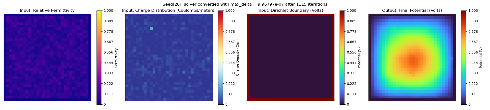
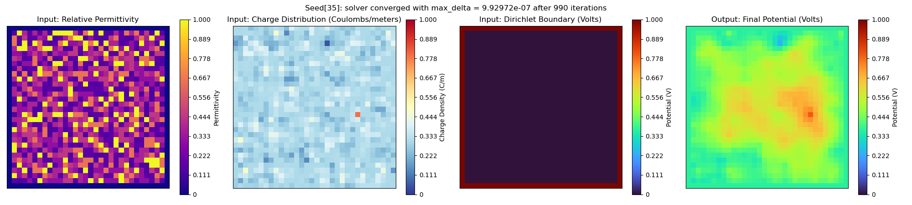
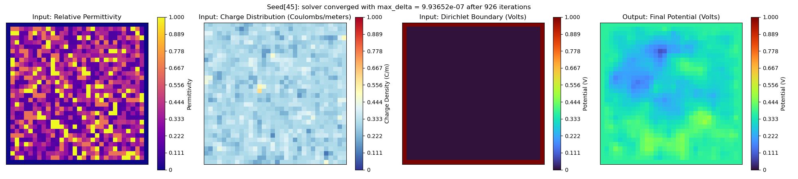
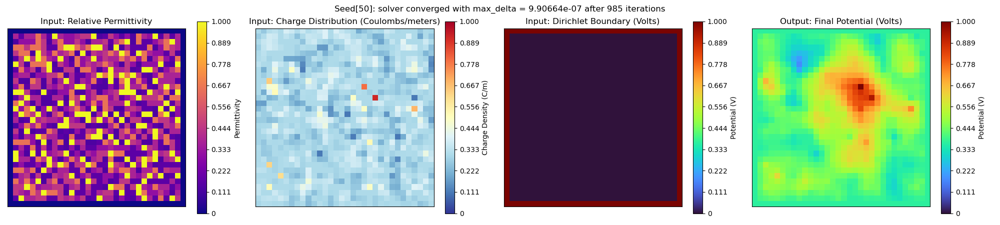
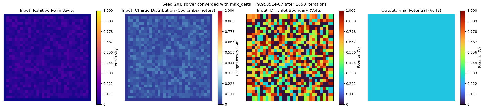
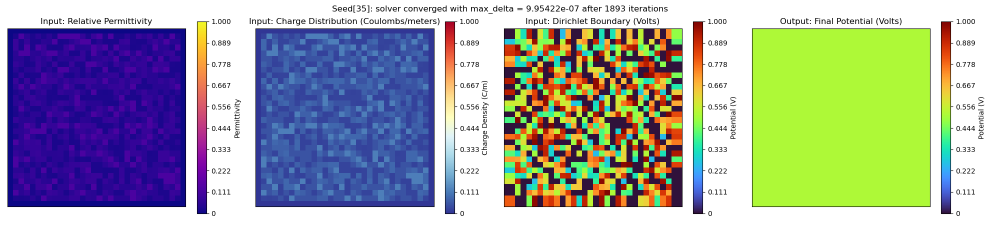
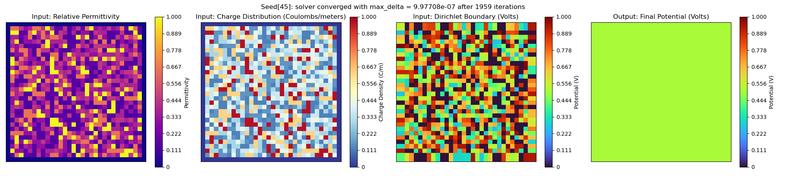
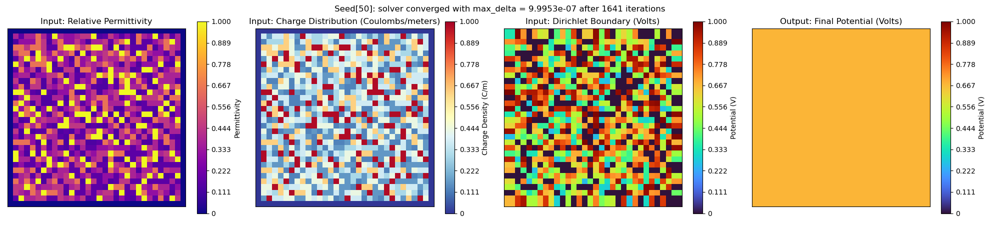

# Electrostatic Potential (ESP) Simulation

## Create and activate Conda environment

```bash
cd esp_simulation
conda env create -f environment.yaml
conda activate esp_env
```

### Notes
- Most of the packages are common, so you may already have these installed

## Generate and save datasets

### File: `create_dataset.py`

### Example run with all options

```bash
python3 create_dataset.py \
  # 1. Output options
  --output-path "<path/to/dir>" \         # Ouput directory to save to, defaults to project root
  --output-folder "<folder_name>" \       # Output folder name, required for dataset creation
  --debug                                 # Enables DEBUG level logging, otherwise default is INFO
  
  # 2. Dataset creation options
  --min-seed 1 \                          # Min RNG seed 
  --max-seed 1000 \                       # Max RNG seed 
  --seed-step 100 \                       # Seeds each core should process at a time (saves memory)
  --ntasks 2 \                            # Number of multiprocessing cores, seeds are divided between core

  # 4. Primary image generation options
  --image-size 32 \                       # Size of one side of the grid image 
  ## 4-A. Mutually Exclusive Options:
  [--conductive-cell-ratio 0.5] \         # Proportion of cells that should be conductive (static)
  [--conductive-cell-prob 0.5] \          # Probability a cell will be conductive or not (random)
  ## 4-B. Mutually Exclusive Options:
  [--conductive-material-range 1,12]  \   # Range to random select count of conductive material types
  [--conductive-material-count 5]  \      # Count of conductive material types to add (static) 

  # 5. Simulation behavior options
  --max-iterations 2000 \                 # Increase/decrease depending on image size and observed simulation behavior
  --convergence-tolerance 1e-6 \          # Tolerance for determining when solution has converged
  --enable-fixed-charges  \               # Charges are fixed instead of free (less variation, different solver)
  --enable-absolute-permittivity          # Alternative to using dielectric constants (uncommon, can ignore)
  --save-states                           # Saves all intermediate potential map states (optional, adds overhead)
```

### Example dataset creation from simulating free charges (Poisson's Solver)

```bash
python3 create_dataset.py \
  --output-folder=hdf5_dataset_example \
  --ntasks=1 \
  --min-seed=1 \                 
  --max-seed=1000 \                    
  --seed-step=100 \ 
  --image-size=32 \ 
  --max-iterations=2000 \
  --conductive-cell-prob=0.7 \ 
  --conductive-material-range=1,10 

# Outputs: ./hdf5_dataset_example_1/electrostatic_poisson_32x32_1-1000.hdf5
```

### Example dataset creation from simulating fixed charges (Laplace's solver)

```bash
python3 create_dataset.py \
  --output-folder=hdf5_dataset_example \
  --ntasks=2 \
  --min-seed=1 \                 
  --max-seed=1000 \                    
  --seed-step=100 \ 
  --image-size=32 \ 
  --max-iterations=3000 \
  --conductive-cell-ratio=0.5 \ 
  --conductive-material-count=5
  --enable-fixed-charges

# Outputs: ./hdf5_dataset_example_2/electrostatic_laplace_32x32_1-1000.hdf5
```

## Normalize dataset, plot samples, or reformat for SimVP

### File: `process_dataset.py`

### Example run with all options

```bash
python3 process_dataset.py \
  # 1. Input options
  --dataset-path "<path/to/datafile>" \   # Input path to dataset file to read and process

  # 2. Output options
  --output-path "<path/to/dir>" \         # Output directory outside of project root, defaults to project root
  --output-folder "<folder_name>" \       # Output folder name, defaults to [--dataset-path] root dir

  # 3. Dataset format options
  --simvp-format \                        # Option to save the dataset specifically formatted for SimVP
  --disable-normalization \               # Prevent default behavior to normalize all images and scalars 

  # 4. Visualization options
  --sample-plots <int> \                  # Number of samples to plot from the [--dataset-path] hdf5 file
  --plot-states                           # Option to plot intermediate states, if saved in created dataset
```

### Example run to normalize and reformat for SimVP dataset 

```bash
python3 process_dataset.py \
    --dataset-path="hdf5_dataset_1/electrostatic_poisson_32x32_1-1000.hdf5" \
    --output-folder=simvp_example_1 \
    --sample-plots=25 \  # omit for no plots
    --simvp-format

# Outputs: ./simvp_dataset_1/[simvp formatted structures ...]
#          ./simvp_dataset_1/plots/[sample plot files ...]
```

### Example run to normalize and plot 25 normalized samples (HDF5 format only)

```bash
python3 process_dataset.py \
    --dataset-path="hdf5_dataset_1/electrostatic_poisson_32x32_1-1000.hdf5" \
    --sample-plots=25  # omit for no plots

# Outputs: ./hdf5_dataset_1/normalized_electrostatic_poisson_32x32_1-1000.hdf5
#          ./hdf5_dataset_1/plots/[sample plot files ...]
```

### Example run to plot 25 unnormalized samples (HDF5 format only)

```bash
python3 process_dataset.py \
    --dataset-path="hdf5_dataset_1/electrostatic_poisson_32x32_1-1000.hdf5" \
    --sample-plots=25 \
    --disable-normalization

# Outputs: /hdf5_dataset_1/plots/[sample plot files ...]
```

### General Notes
- Scripts in `example_scripts/`:
  - `create_hdf5_dataset.sh` → `create_dataset.py`: Generates HDF5 dataset from simulation runs
  - `normalize_hdf5_dataset.sh` → `process_dataset.py`: Normalizes HDF5 dataset; optionally plots samples
  - `plot_dataset_samples.sh` → `process_dataset.py`: Plots samples from original HDF5 dataset
  - `reformat_for_simvp.sh` → `process_dataset.py`: Converts HDF5 to SimVP format; optionally plots samples
- Output:
  - Sample plots → `path/to/<output_folder>/plots`
  - Logs → `esp_simulation/logs`
  - Global extrema normalization is enabled by default

### HDF5 Format
- Each simulation saved as a group with:
  - **Scalar groups** (`meta`, `metric`): stored as attributes
  - **Array groups** (`mask`, `image`): stored as datasets
- Normalization:
  - Only `image` and `metric` are normalized
  - Global extrema saved to: `global_extrema_hdf5_<original_datafile>.json`

### SimVP Format
- Target format for: https://github.com/drewg02/OpenSTL.git
- Each frame → folder: `<hash>_<datatype>_<id>`
  - Files:
    - `0.npy`: Input (3-channel): Initial Potential, Permittivity, Charge
    - `1.npy`: Output (1-channel): Final Potential
- Global extrema saved to: `global_extrema_npy_<original_datafile>.json`

### Solver Notes
- Default: *free charges* (Poisson’s equation + Dirichlet BCs)
  - More variation, longer sim time
  - Charge distribution is generated
- With `--enable-fixed-charges`: *fixed charges* (Laplace’s equation + Neumann BCs)
  - Less variation, faster sim time
  - Charge distribution is derived

### Material ID Mask Generation
1. Initial conductive mask:
   - `--conductive-cell-ratio`: fixed % of conductive cells
   - `--conductive-cell-prob`: probabilistic cell assignment
2. Cellular automata + connectivity algorithm applied
3. Add *conductive* materials:
   - `--conductive-material-count`: fixed count
   - `--conductive-material-range`: random count from range
4. Fill remaining cells with *insulation* materials
5. Boundary cells are set to free space (vacuum/air)


### Reproducibility Notes
- Samples generated via `[--min-seed]` to `[--max-seed]`
- Simulations reproducible with same seed + arguments
  - Args saved to: `arguments_<original_datafile>.json`


### Sample simulation results for free charges





### Sample simulation results for fixed charges




*Note: Due to global  color map boundaries, images with tiny differences appear as one color.*