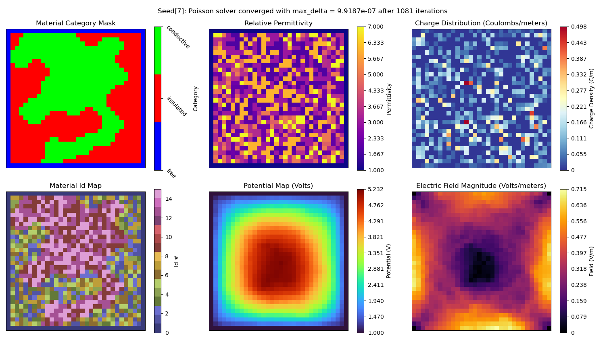
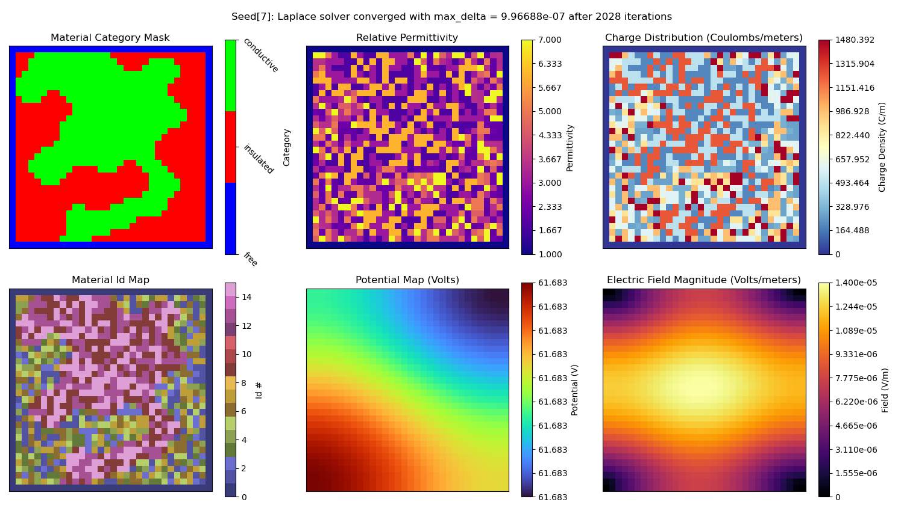

# Electrostatic Potential (ESP) Simulation

## Create and activate Conda environment

```bash
cd esp_simulation
conda env create -f environment.yaml
conda activate esp_env
```

### Notes
- Most of the packages are common, so you may already have these installed

## Generate and save datasets

### File: `create_dataset.py`

### Example run with all options

```bash
python3 create_dataset.py \
  # 1. Output options
  --output-path "<path/to/dir>" \         # Ouput directory to save to, defaults to project root
  --output-folder "<folder_name>" \       # Output folder name, required for dataset creation
  --debug                                 # Enables DEBUG level logging, otherwise default is INFO
  
  # 2. Dataset creation options
  --min-seed 1 \                          # Min RNG seed 
  --max-seed 1000 \                       # Max RNG seed 
  --seed-step 100 \                       # Seeds each core should process at a time (saves memory)
  --ntasks 2 \                            # Number of multiprocessing cores, seeds are divided between core

  # 4. Primary image generation options
  --image-size 32 \                       # Size of one side of the grid image 
  ## 4-A. Mutually Exclusive Options:
  [--conductive-cell-ratio 0.5] \         # Proportion of cells that should be conductive (static)
  [--conductive-cell-prob 0.5] \          # Probability a cell will be conductive or not (random)
  ## 4-B. Mutually Exclusive Options:
  [--conductive-material-range 1,12]  \   # Range to random select count of conductive material types
  [--conductive-material-count 5]  \      # Count of conductive material types to add (static) 

  # 5. Simulation behavior options
  --max-iterations 2000 \                 # Increase/decrease depending on image size and observed simulation behavior
  --convergence-tolerance 1e-6 \          # Tolerance for determining when solution has converged
  --enable-fixed-charges  \               # Charges are fixed instead of free (less variation, different solver)
  --enable-absolute-permittivity          # Alternative to using dielectric constants (uncommon, can ignore)
```

### Example runs with minimal options for creating a dataset

```bash
# Outputs: ./hdf5_dataset_1/electrostatic_poisson_32x32_1-1000.hdf5
python3 create_dataset.py \
  --output-folder=hdf5_dataset_1 \
  --ntasks=1 \
  --min-seed=1 \                 
  --max-seed=1000 \                    
  --seed-step=100 \ 
  --image-size=32 \ 
  --max-iterations=2500 \
  --conductive-cell-ratio=0.65 \ 
  --conductive-material-count=5 

# Outputs: ./hdf5_dataset_2/electrostatic_poisson_32x32_500-1500.hdf5
python3 create_dataset.py \
  --output-folder=hdf5_dataset_2 \
  --ntasks=2 \
  --min-seed=500 \                 
  --max-seed=1500 \                    
  --seed-step=100 \ 
  --image-size=32 \ 
  --max-iterations=2500 \
  --conductive-cell-prob=0.5 \ 
  --conductive-material-range=1,3 

# Outputs: ./hdf5_dataset_3/electrostatic_laplace_32x32_2500-5100.hdf5
python3 create_dataset.py \
  --output-folder=hdf5_dataset_3 \
  --ntasks=3 \
  --min-seed=2500 \                 
  --max-seed=5100 \                    
  --seed-step=100 \ 
  --image-size=32 \ 
  --max-iterations=5000 \
  --conductive-cell-prob=0.75 \ 
  --conductive-material-count=1 \
  --enable-fixed-charges 

# Outputs: ./hdf5_dataset_4/electrostatic_laplace_32x32_100-1500.hdf5
python3 create_dataset.py \
  --output-folder=hdf5_dataset_4 \
  --ntasks=4 \
  --min-seed=100 \                 
  --max-seed=1500 \                    
  --seed-step=100 \ 
  --image-size=32 \ 
  --max-iterations=5000 \
  --conductive-cell-ratio=0.25 \ 
  --conductive-material-range=1,10 \
  --enable-fixed-charges 
```

## Normalize dataset, plot samples, or reformat for SimVP

### File: `process_dataset.py`

### Example run with all options

```bash
python3 create_dataset.py \
  # 1. Input options
  --dataset-path "<path/to/datafile>" \   # Input path to dataset file to read and process

  # 2. Output options
  --output-path "<path/to/dir>" \         # Output directory outside of project root, defaults to project root
  --output-folder "<folder_name>" \       # Output folder name, defaults to [--dataset-path] root dir

  # 3. Dataset format options
  --simvp-format \                        # Option to save the dataset specifically formatted for SimVP
  --disable-normalization \               # Prevent default behavior to normalize all images and scalars 

  # 4. Visualization options
  --sample-plots <int>                   # Number of samples to plot from the [--dataset-path] hdf5 file
```

### Example run to normalize and reformat for SimVP dataset 

```bash
python3 process_dataset.py \
    --dataset-path="hdf5_dataset_1/electrostatic_poisson_32x32_1-1000.hdf5" \
    --output-folder=simvp_example_1 \
    --simvp-format \
    --sample-plots=100  # omit for no plots

# Outputs: ./simvp_dataset_1/[simvp formatted structures ...]
#          ./simvp_dataset_1/plots/[sample plot files ...]
```

### Example run to normalize to a HDF5 file

```bash
python3 process_dataset.py \
    --dataset-path="hdf5_dataset_1/electrostatic_poisson_32x32_1-1000.hdf5" \
    --sample-plots=100  # omit for no plots

# Outputs: ./hdf5_dataset_1/normalized_electrostatic_poisson_32x32_1-1000.hdf5
#          ./hdf5_dataset_1/plots/[sample plot files ...]
```

### Example run to plot samples only (HDF5 format only)

```bash
python3 process_dataset.py \
    --dataset-path="hdf5_dataset_1/electrostatic_poisson_32x32_1-1000.hdf5" \
    --sample-plots=100 \
    --disable-normalization

# Outputs: /hdf5_dataset_1/plots/[sample plot files ...]
```

### General Notes
- Example scripts are saved to: `example_scripts`
  1. `create_hdf5_dataset.sh` 
    - Executable program: `create_dataset.py`
    - Creates an HDF5 dataset from a set of simulation runs
  2. `normalize_hdf5_dataset.sh`
    - Executable program: `process_dataset.py`
    - Creates a normalized HDF5 dataset from an existing HDF5 dataset
    - Optionally can save sample plots of the normalized data
  3. `plot_dataset_samples.sh`
    - Executable program: `process_dataset.py`
    - Demonstrates only plotting samples from the original HFD5 dataset
  4. `reformat_for_simvp.sh`
      - executable program: `process_dataset.py`
      - Converts an existing HDF5 dataset into a compatible format for SimVP
      - Optionally can plot samples of the data reformatted for SimVP
- Sample plots are saved in: `path/to/<output_folder_name>/plots`
- Logs for stdout/stderr are saved in: `esp_simulation/logs`
- Normalization is enabled by default and uses min/max scaling between 0.0, 1.0 
  - Global extrema values are computed for all numerical data across the entire dataset
    - The global extrema for arrays is the min and max cell values for all instances of that array
    - Likewise, the global extrema for scalars is the min and max values for all instances of that scalar
  - Samples plotted from non-normalized datasets used the saved global extrema for the color map boundaries

### HDF5 Format Notes
- Default HDF5 formatted dataset will contain simulation records of all relevant simulation data
  - Scalar groups: `['meta', 'metric']`, saved as HDF5 Attributes
    - `metadata`: metadata from the simulation run (e.g., total iterations)
    - `metric`: numerical data computed from the simulation output (e.g., total charge)
  - Array groups: `['mask', 'image']`, saved as HDF5 Datasets
      - `mask`: categorical masks for data generation (e.g., binary mask for conductive cells)
      - `image`: 2D arrays containing computed numerical data (e.g., charge distribution)
- Global extrema values for normalization are saved to: `path/to/<output_folder_name>/global_extrema_hdf5_<original_datafile_name>.json`
    - Only `'images'` `'metrics'` groups are normalized (`masks` are categorical and `'meta'` is metadata)
- Each simulation record is output to a HDF5 Group containing the above Groups
  <details>   
    <summary>EXAMPLE RECORD STRUCTURE </summary> 

    ```plaintext
    GROUP "record_1" {
      GROUP "image" {
          DATASET "charge_distribution" {
            DATATYPE  H5T_IEEE_F64LE
            DATASPACE  SIMPLE { ( 32, 32 ) / ( 32, 32 ) }
          }
          DATASET "electric_field_magnitude" {
            DATATYPE  H5T_IEEE_F64LE
            DATASPACE  SIMPLE { ( 32, 32 ) / ( 32, 32 ) }
          }
          DATASET "electric_field_x" {
            DATATYPE  H5T_IEEE_F64LE
            DATASPACE  SIMPLE { ( 32, 32 ) / ( 32, 32 ) }
          }
          DATASET "electric_field_y" {
            DATATYPE  H5T_IEEE_F64LE
            DATASPACE  SIMPLE { ( 32, 32 ) / ( 32, 32 ) }
          }
          DATASET "final_potential_map" {
            DATATYPE  H5T_IEEE_F64LE
            DATASPACE  SIMPLE { ( 32, 32 ) / ( 32, 32 ) }
          }
          DATASET "initial_potential_map" {
            DATATYPE  H5T_IEEE_F64LE
            DATASPACE  SIMPLE { ( 32, 32 ) / ( 32, 32 ) }
          }
          DATASET "permittivity_map" {
            DATATYPE  H5T_IEEE_F64LE
            DATASPACE  SIMPLE { ( 32, 32 ) / ( 32, 32 ) }
          }
      }
      GROUP "mask" {
          DATASET "conductive_material_map" {
            DATATYPE  H5T_ENUM {
                H5T_STD_I8LE;
                "FALSE"            0;
                "TRUE"             1;
            }
            DATASPACE  SIMPLE { ( 32, 32 ) / ( 32, 32 ) }
          }
          DATASET "material_category_map" {
            DATATYPE  H5T_STD_I64LE
            DATASPACE  SIMPLE { ( 32, 32 ) / ( 32, 32 ) }
          }
          DATASET "material_id_map" {
            DATATYPE  H5T_STD_I64LE
            DATASPACE  SIMPLE { ( 32, 32 ) / ( 32, 32 ) }
          }
      }
      GROUP "meta" {
          ATTRIBUTE "converged" {
            DATATYPE  H5T_STD_I64LE
            DATASPACE  SCALAR
          }
          ATTRIBUTE "image_size" {
            DATATYPE  H5T_STD_I64LE
            DATASPACE  SCALAR
          }
          ATTRIBUTE "max_delta" {
            DATATYPE  H5T_IEEE_F64LE
            DATASPACE  SCALAR
          }
          ATTRIBUTE "random_seed" {
            DATATYPE  H5T_STD_I64LE
            DATASPACE  SCALAR
          }
          ATTRIBUTE "total_iterations" {
            DATATYPE  H5T_STD_I64LE
            DATASPACE  SCALAR
          }
      }
      GROUP "metric" {
          ATTRIBUTE "electric_flux" {
            DATATYPE  H5T_IEEE_F64LE
            DATASPACE  SCALAR
          }
          ATTRIBUTE "total_charge" {
            DATATYPE  H5T_IEEE_F64LE
            DATASPACE  SCALAR
          }
          ATTRIBUTE "total_energy" {
            DATATYPE  H5T_IEEE_F64LE
            DATASPACE  SCALAR
          }
      }
    }
    ```
  <details> 

### SimVP Format Notes
- Optional SimVP formatted dataset only includes the minimal input/output images
- Specifically formatted for this fork of SimVP: https://github.com/drewg02/OpenSTL.git
- Each simulation frame is saved to folder: `<unique_hash>_<datatype_name>_<#id>`
  - `<unique_hash>` is a hash of the input conditions
  - `<datatype_name>` is the simulation data name: `electrostatic`
  - `<#id>` is a numeric ID for the simulation outputs from 0 to N (not based on seed #)
- Each folder contains 2 NumPy files:
  - `<unique_hash>_<datatype_name>_<#id>/0.npy`: Input images saved as (Channels x Width X Height)
    - Initial condition images (3 Channels): `Initial Potential Map`, `Relative Permittivity`, `Charge Distribution`
  - `<unique_hash>_<datatype_name>_<#id>/1.npy`: Output image saved as (1 x Width X Height)
    - Final state image (1 Channels): `Final Potential Map`
- Global extrema values for normalization are saved to: `path/to/<output_folder_name>/global_extrema_npy_<original_datafile_name>.json`
    - All initial condition images and final state images are normalized respectively

### Simulation Solver Notes:
- The solver equations used depends on if charges are considered *free* or *fixed*
- By default charges are considered *free*, meaning they affect the electrostatic potential over time
  - Free charges provide variation in the output, faster convergence, but longer simulation times
  - Solves with [Poisson's equation](https://en.wikipedia.org/wiki/Discrete_Poisson_equation) for a discretized 2D grid
  - Applies [Dirichlet boundary conditions](https://en.wikipedia.org/wiki/Dirichlet_boundary_condition), where boundaries are fixed to the permittivity of free-space
- If `[--enable-fixed-charges]` is set, then charges are fixed, meaning electrostatic potential is constant
  - Fixed charges have less variation in the output, slower convergence, but faster simulation times overall
  - Solves with [Laplace's equation](https://en.wikipedia.org/wiki/Laplace%27s_equation#Electrostatics), which is derived from Poisson 
  - Applies [Neumann boundary conditions](https://en.wikipedia.org/wiki/Neumann_boundary_condition), where boundaries reflect the behavior of inner cells

### Material Map Generation Notes:
1. Initial conductive mask is created with options:
  - `[--conductive-cell-ratio]`: Proportion of cells that should be conductive 
    - Samples will have a consistent number of conductive cells
    - Locations of conductive cells are randomized based on RNG seed
  - `[--conductive-cell-prob]`: Probability a cell is conductive or not 
    - Samples will have a variable number of conductive cells based on probability and RNG seed
    - Locations of conductive cells determined by the probability and RNG seed
2. Cellular automata + Connecting algorithm is applied to the initial conductive mask
3. Conductive materials are added to the final conductive mask
  - `[--conductive-material-count]`: Static count of conductor materials to add 
    - Samples will have a consistent number of conductive material types
  - `[--conductive-material-range]`: Range to randomly select count of conductor materials to add
    - Samples will have a variable number of conductive material types
  - Selected conductive materials are randomized based on RNG seed for both options
4. Remaining non-border cells are filled randomly based on RNG seed with isolating materials
5. The borders are set to `free space` to create an isolated environment to start with

### Reproducibility Notes:
- Total simulation samples is based on seed range:
  - `[--min-seed]` and `[--max-seed]`
- Each seed can be used to reproduce a simulation given the same arguments
  - Input arguments are saved to a JSON file saved to: `path/to/<output_folder_name>/arguments_<original_datafile_name>.json`

#### Sample simulation result for free charges


#### Sample simulation result for fixed charges

