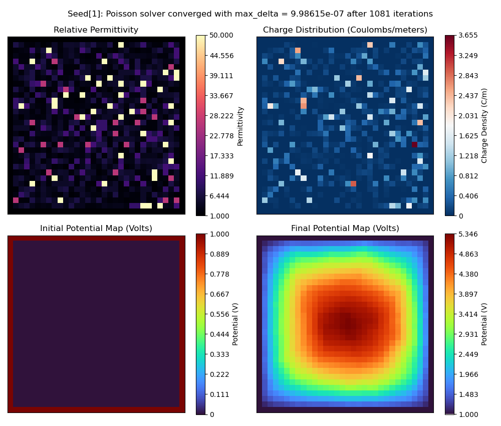
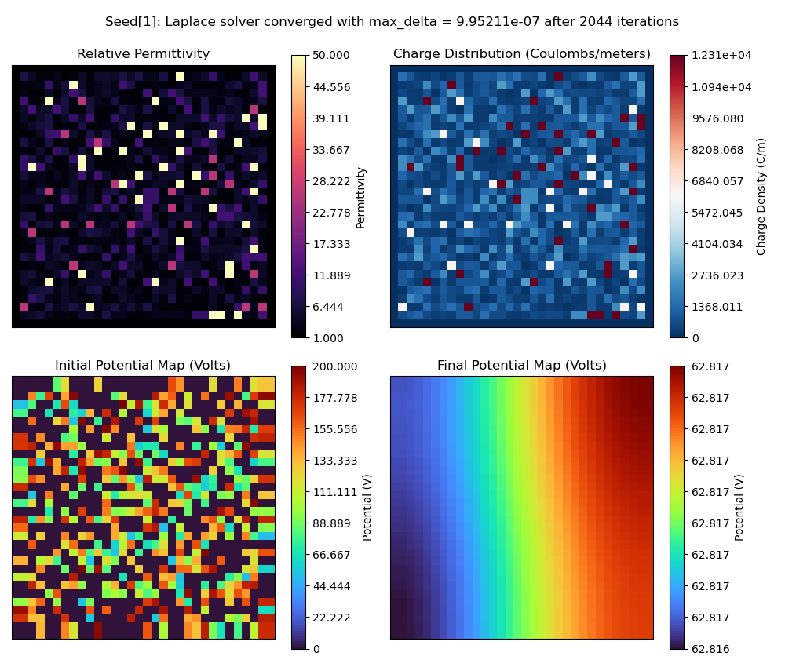

# Electrostatic Potential (ESP) Simulation

## Create and activate Conda environment

```bash
cd esp_simulation
conda env create -f environment.yaml
conda activate esp_env
```

### Notes
- Most of the packages are common, so you may already have these installed

## Generate and save datasets

### File: `create_dataset.py`

### Example run with all options

```bash
python3 create_dataset.py \
  --output-path "<path/to/dir>" \               # Ouput directory outside of project root
  --output-folder "<output_folder_name>" \      # Output folder name
  --min-seed 1 \                                # Min RNG seed 
  --max-seed 1000 \                             # Max RNG seed 
  --seed-step 100 \                             # Seeds each core should process at a time (saves memory)
  --image-size 64 \                             # Size of one side of the grid image 
  --material-cell-ratio 0.75 \                  # How many cells should have a material (non air)
  --conductive-material-ratio 0.4 \             # How many materials should be conductors?
  --max-iterations 5000 \                       # Increase/decrease depending on size and materials
  --convergence-tolerance 1e-6 \                # Tolerance for determining when solution has converged
  --ntasks 2 \                                  # Number of multiprocessing cores 
  --simvp-format \                              # Option to save the dataset specifically formatted for SimVP
  --plot-samples \                              # Plots random samples of simulation outputs (HDF5 option only)
  --disable-normalization \                     # Prevented default behavior to normalize all computed images and scalars
  --enable-fixed-charges  \                     # Charge distribution is fixed instead of free (less variation, different solver)
  --enable-absolute-permittivity                # Alternative to using dielectric constants (uncommon, can ignore)
```

### Example run with minimal options for HDF5 dataset

```bash
python3 create_dataset.py \
  --min-seed=100 \                 
  --max-seed=5100 \                    
  --seed-step=100 \ 
  --image-size=64 \ 
  --material-cell-ratio=0.75 \
  --conductive-material-ratio=0.25 \ 
  --max-iterations=5000 \
  --ntasks=2 \
  --plot-samples
```

### Example run with minimal options for SimVP dataset

```bash
python3 create_dataset.py \
  --min-seed=1 \                 
  --max-seed=1000 \                    
  --seed-step=50 \ 
  --image-size=32 \ 
  --material-cell-ratio=1.0 \
  --conductive-material-ratio=0.5 \ 
  --max-iterations=2000 \
  --ntasks=2 \
  --simvp-format 
```

### General Notes
- Example scripts: `scripts/{create_hdf5_dataset.sh, create_simvp_dataset.sh`
- Sample plots are saved in: `path/to/<output_folder_name>/plots`
- Logs for stdout/stderr are saved in: `esp_simulation/logs`
- Normalization is enabled by default and uses min/min scaling between 0.0, 1.0
  - Each individual computed data value/array is scaled by the global min and max
  - This means all arrays `my_arr_b`, are scaled using the min and max values across all records of `my_arr_b`
  - The global min and max values are saved to a JSON file regardless if normalization is enabled
    - Useful if normalizing elsewhere or for unscaling the data later

### HDF5 Format Notes
- Default HDF5 formatted dataset will contain simulation records of all relevant simulation data
  - Scalar groups: `['meta', 'metric']`, saved as HDF5 Attributes
    - `metadata`: metadata from the simulation run (e.g., total iterations)
    - `metric`: numerical data computed from the simulation output (e.g., total charge)
  - Array groups: `['mask', 'image']`, saved as HDF5 Datasets
      - `mask`: categorical masks for data generation (e.g., binary mask for conductive cells)
      - `image`: 2D arrays containing computed numercial data (e.g., charge distribution)
- Each simulation record is output to a HDF5 Group containing the above Groups
    <details>   
    <summary> Example Record Structure </summary> 

    ```plaintext
    GROUP "record_1" {
      GROUP "image" {
          DATASET "charge_distribution" {
            DATATYPE  H5T_IEEE_F64LE
            DATASPACE  SIMPLE { ( 32, 32 ) / ( 32, 32 ) }
          }
          DATASET "electric_field_magnitude" {
            DATATYPE  H5T_IEEE_F64LE
            DATASPACE  SIMPLE { ( 32, 32 ) / ( 32, 32 ) }
          }
          DATASET "electric_field_x" {
            DATATYPE  H5T_IEEE_F64LE
            DATASPACE  SIMPLE { ( 32, 32 ) / ( 32, 32 ) }
          }
          DATASET "electric_field_y" {
            DATATYPE  H5T_IEEE_F64LE
            DATASPACE  SIMPLE { ( 32, 32 ) / ( 32, 32 ) }
          }
          DATASET "final_potential_map" {
            DATATYPE  H5T_IEEE_F64LE
            DATASPACE  SIMPLE { ( 32, 32 ) / ( 32, 32 ) }
          }
          DATASET "initial_potential_map" {
            DATATYPE  H5T_IEEE_F64LE
            DATASPACE  SIMPLE { ( 32, 32 ) / ( 32, 32 ) }
          }
          DATASET "permittivity_map" {
            DATATYPE  H5T_IEEE_F64LE
            DATASPACE  SIMPLE { ( 32, 32 ) / ( 32, 32 ) }
          }
      }
      GROUP "mask" {
          DATASET "conductive_material_map" {
            DATATYPE  H5T_ENUM {
                H5T_STD_I8LE;
                "FALSE"            0;
                "TRUE"             1;
            }
            DATASPACE  SIMPLE { ( 32, 32 ) / ( 32, 32 ) }
          }
          DATASET "material_category_map" {
            DATATYPE  H5T_STD_I64LE
            DATASPACE  SIMPLE { ( 32, 32 ) / ( 32, 32 ) }
          }
          DATASET "material_id_map" {
            DATATYPE  H5T_STD_I64LE
            DATASPACE  SIMPLE { ( 32, 32 ) / ( 32, 32 ) }
          }
      }
      GROUP "meta" {
          ATTRIBUTE "converged" {
            DATATYPE  H5T_STD_I64LE
            DATASPACE  SCALAR
          }
          ATTRIBUTE "image_size" {
            DATATYPE  H5T_STD_I64LE
            DATASPACE  SCALAR
          }
          ATTRIBUTE "max_delta" {
            DATATYPE  H5T_IEEE_F64LE
            DATASPACE  SCALAR
          }
          ATTRIBUTE "random_seed" {
            DATATYPE  H5T_STD_I64LE
            DATASPACE  SCALAR
          }
          ATTRIBUTE "total_iterations" {
            DATATYPE  H5T_STD_I64LE
            DATASPACE  SCALAR
          }
      }
      GROUP "metric" {
          ATTRIBUTE "electric_flux" {
            DATATYPE  H5T_IEEE_F64LE
            DATASPACE  SCALAR
          }
          ATTRIBUTE "total_charge" {
            DATATYPE  H5T_IEEE_F64LE
            DATASPACE  SCALAR
          }
          ATTRIBUTE "total_energy" {
            DATATYPE  H5T_IEEE_F64LE
            DATASPACE  SCALAR
          }
      }
    }
    ```

    <details> 
- Can manually add/remove saved data in: `[electrostatic_simulation.py:run_electrostatic_simulation()]`
  - Or just filter what you need after reading record in with: `[utilities.py:read_from_hdf5()]`
- HDF5 data files are saved in: `path/to/<output_folder_name>/data`
- Global min/max normalization values are saved to: `path/to/<output_folder_name>/global_min_max_values_hdf5.json`
  - Only `'images'` and `'metrics'` groups are normalized, `masks` are catagorical 

### SimVP Format Notes
- Optional SimVP formatted dataset only includes the minimal input/output images
- Specifically formatted for this fork of SimVP: https://github.com/drewg02/OpenSTL.git
- Each simulation frame is saved to folder: `<unique_hash>_<datatype_name>_<#id>`
  - `<unique_hash>` is a hash of the input conditions
  - `<datatype_name>` is the simulation data name: `electrostatic`
  - `<#id>` is a numeric ID for the simulation outputs from 0 to N (not based on seed #)
- Each folder contains 2 NumPy files:
  - `<unique_hash>_<datatype_name>_<#id>/0.npy`: Input images saved as (Channels x Width X Height)
    - Initial condition images (3 Channels): *Initial Potential Map*, *Relative Permittivity*, *Charge Distribution*
  - `<unique_hash>_<datatype_name>_<#id>/1.npy`: Output image saved as (1 x Width X Height)
    - Final state image (1 Channels): `Final Potential Map`
- Can manually add/remove any images in `[utilities.py:normalize_hdf5_to_numpy()]` 
  - Any array from the `'image'` group can be added as an input or output 
  - If SimVP supports encoding categorical data, you can add arrays from `mask`
- Global min/max normalization values are saved to: `path/to/<output_folder_name>/global_min_max_values_simvp.json`

### Simulation Solver Notes:
- The solver equations used depends on if charges are considered *free* or *fixed*
- By default charges are considered *free*, meaning they affect the electrostatic potential over time
  - Free charges provide variation in the output, but longer simulation times
  - Solves with [Poisson's equation](https://en.wikipedia.org/wiki/Discrete_Poisson_equation) for a discretized 2D grid
  - Applies [Dirichlet boundary conditions](https://en.wikipedia.org/wiki/Dirichlet_boundary_condition), where boundaries are fixed to the permittivity of free-space
- If `[--enable-fixed-charges]` is set, then charges are fixed, meaning electrostatic potential is constant
  - Fixed charges have less variation in the output, but faster simulation times
  - Solves with [Laplace's equation](https://en.wikipedia.org/wiki/Laplace%27s_equation#Electrostatics), which is derived from Poisson 
  - Applies [Neumann boundary conditions](https://en.wikipedia.org/wiki/Neumann_boundary_condition), where boundaries reflect the behavior of inner cells


#### Sample simulation result for free charges


#### Sample simulation result for fixed charges

